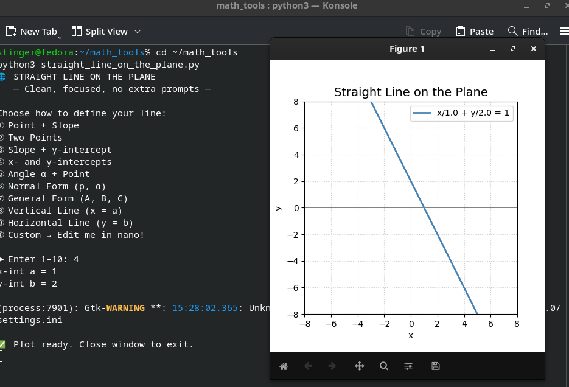

# 📐 Straight Line on the Plane

A minimal, focused Python toolkit for exploring all classical ways to define a straight line in 2D analytic geometry.

> ✅ No clutter. No “90° perpendicular” prompts. Just pure math + plotting.

---

## 🚀 Features

- Interactive CLI menu with 10+ input methods
- Plots using `matplotlib`
- Clean folder structure
- Easy to extend (add your own “Custom” option!)

---

## 📋 Input Methods

| Option | Description |
|--------|-------------|
| ①      | Point + Slope |
| ②      | Two Points |
| ③      | Slope + y-intercept |
| ④      | x- and y-intercepts |
| ⑤      | Angle α + Point |
| ⑥      | Normal Form (p, α) |
| ⑦      | General Form (A, B, C) |
| ⑧      | Vertical Line (x = a) |
| ⑨      | Horizontal Line (y = b) |
| ⑩      | Custom → Edit me! |

---

## 🖼️ Screenshot



*(Screenshot of a 45° line through origin — see below how to add it)*

---

## 🛠️ Setup

```bash
# Install matplotlib (if not already)
pip3 install --user matplotlib

# Run the tool
cd ~/math_tools
python3 straight_line_on_the_plane.py
